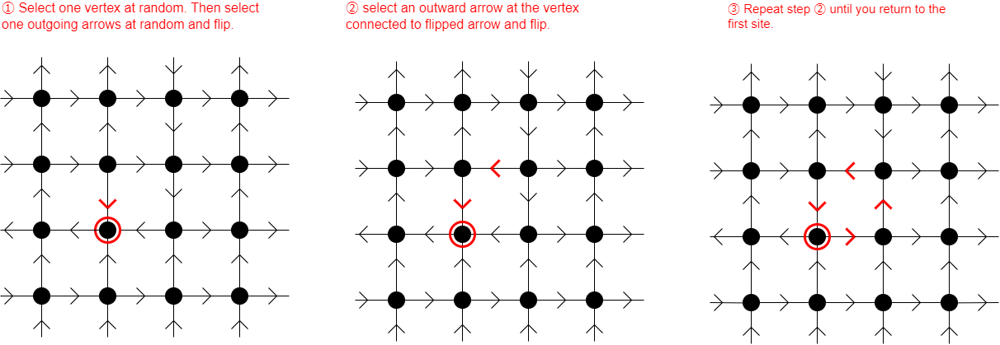

# spinice


## Description

Implementation Monte-Carlo simulation of 2D square lattice spin ice model.

## Introduction

### long-loop algorithm



### short-loop algorithm


## Install

```
git clone https://github.com/mktj2685/spinice.git
cd spinice
pip install -r requirements.txt
```

## Usage

```
python main.py
```

## Reference

[1] G. T. Barkema and M. E. J. Newman, 'Monte Carlo simulation of ice models' Phys. Rev. E 57, 1155 (1998)